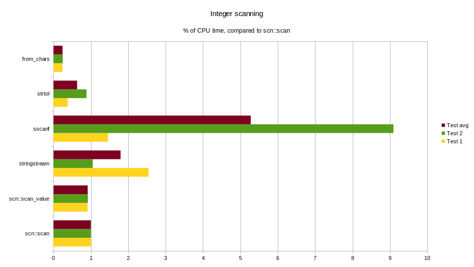
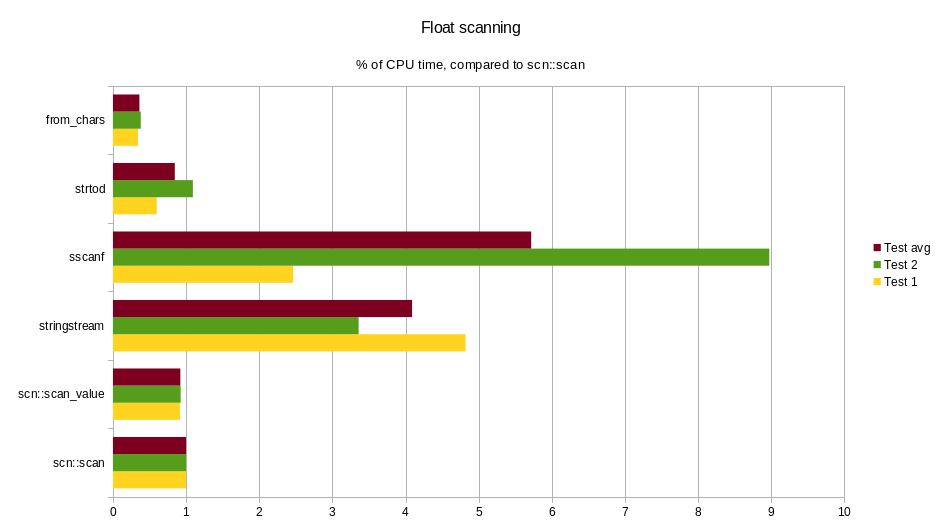
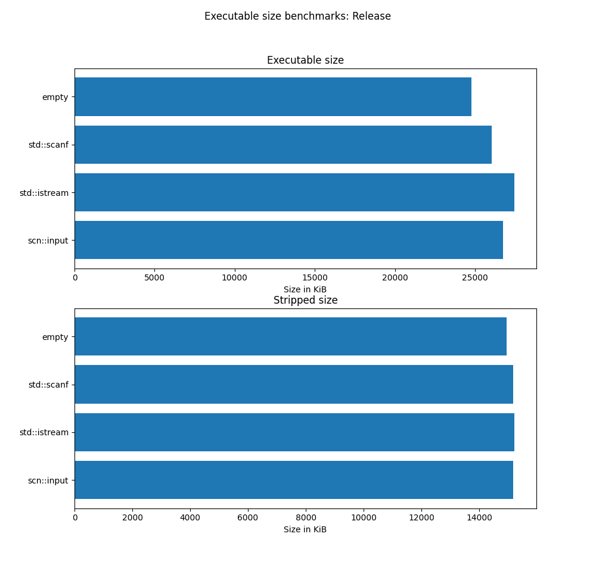
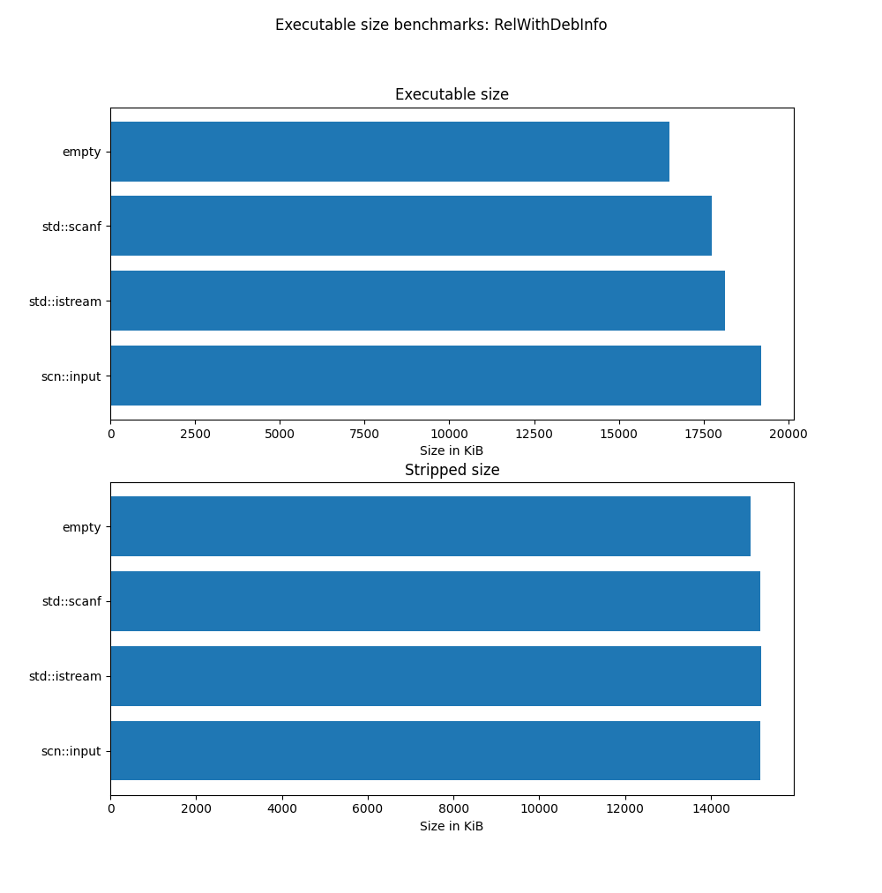
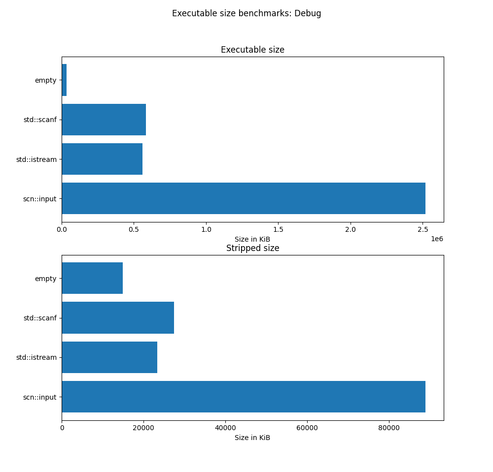

# scnlib

[](https://github.com/eliaskosunen/scnlib/actions/workflows/linux.yml)
[](https://github.com/eliaskosunen/scnlib/actions/workflows/macos.yml)
[](https://github.com/eliaskosunen/scnlib/actions/workflows/windows.yml)
[](https://github.com/eliaskosunen/scnlib/actions/workflows/arch.yml)
[](https://codecov.io/gh/eliaskosunen/scnlib)

[](https://github.com/eliaskosunen/scnlib/releases)
[](https://github.com/eliaskosunen/scnlib/blob/master/LICENSE)
[](https://img.shields.io/badge/C%2B%2B-17%2F20%2F23-blue.svg)

```cpp
#include <scn/scan.h>
#include <print> // for std::println (C++23)

int main() {
    // Read two integers from stdin
    // with an accompanying message
    if (auto result =
            scn::prompt<int>("What are your two favorite numbers? ", "{} {}")) {
        auto [a, b] = result->values();
        std::println("Oh, cool, {} and {}!", a, b);
    } else {
        std::println(stderr, "Error: {}", result.error().msg());
    }
}
```

## What is this?

`scnlib` is a modern C++ library for replacing `scanf` and `std::istream`.
This library attempts to move use ever so much closer to replacing `iostream`s and C stdio altogether.
It's faster than `iostream` (see Benchmarks), and type-safe, unlike `scanf`.
Think [{fmt}](https://github.com/fmtlib/fmt) or C++20 `std::format`, but in the other direction.

This library is the reference implementation of the ISO C++ standards proposal
[P1729 "Text Parsing"](https://wg21.link/p1729).

This branch (dev) targets v2, and is currently unstable.
The master branch contains the latest stable version of the library, with a substantially different interface, and
support for C++11 and C++14.

## Documentation

The documentation can be found online, from https://scnlib.readthedocs.io.

To build the docs yourself, build the `scn_doc` and `scn_doc_sphinx` targets generated by CMake.
These targets are generated only if the variable `SCN_DOCS` is set in CMake (done automatically if scnlib is the root project).
The `scn_doc` target requires Doxygen, and the `scn_doc_sphinx` target requires Python 3.8 or better, Sphinx, and Breathe.

## Examples

See more examples in the `examples/` folder.

### Reading a `std::string`

```cpp
#include <scn/scan.h>
#include <print>

int main() {
    // Reading a std::string will read until the first whitespace character
    if (auto result = scn::scan<std::string>("Hello world!", "{}")) {
        // Will output "Hello":
        // Access the read value with result->value()
        std::println("{}", result->value());
        
        // Will output " world":
        // result->range() returns a subrange containing the unused input
        // C++23 is required for the std::string_view range constructor used below
        std::println("{}", std::string_view{result->range()});
    } else {
        std::println("Couldn't parse a word: {}", result.error().msg());
    }
}
```

### Reading multiple values

```cpp
#include <scn/scan.h>

int main() {
    auto input = std::string{"123 456 foo"};
    
    auto result = scn::scan<int, int>(input, "{} {}");
    // result == true
    // result->range(): " foo"
    
    // All read values can be accessed through a tuple with result->values()
    auto [a, b] = result->values();
    
    // Read from the remaining input
    // Could also use scn::ranges::subrange{result->begin(), result->end()} as input
    auto result2 = scn::scan<std::string>(result->range(), "{}");
    // result2 == true
    // result2->range().empty() == true
    // result2->value() == "foo"
}
```

### Reading from a fancier range

```cpp
#include <scn/scan.h>

// scn::ranges is
//  - std::ranges on C++20 or later (if available)
//  - nano::ranges on C++17 (bundled implementation)
namespace ranges = scn::ranges;

int main() {
    auto result = scn::scan<int>("123" | ranges::views::reverse, "{}");
    // result == true
    // result->begin() is an iterator into a reverse_view
    // result->range() is empty
    // result->value() == 321
}
```

### Repeated reading

```cpp
#include <scn/scan.h>
#include <vector>

int main() {
    std::vector<int> vec{};
    auto input = scn::ranges::subrange{std::string_view{"123 456 789"}};
    
    while (auto result = scn::scan<int>(input), "{}")) {
        vec.push_back(result->value());
        input = result->range();
    }
}
```

## Features

 * Blazing fast parsing of values (see Benchmarks)
 * Modern C++ interface, featuring
   * type safety (variadic templates, types not determined by the format string)
   * convenience (ranges)
   * ergonomics (values returned from `scn::scan`, no output parameters)
 * `"{python}"`-like format string syntax
   * Including compile-time format string checking
 * Minimal code size increase (in user code, see Benchmarks)
 * Usable without exceptions, RTTI, or `<iostream>`s
   * Configurable through build flags
   * Limited functionality if enabled
 * Supports, and requires Unicode (input is UTF-8, UTF-16, or UTF-32)
 * Highly portable
   * Tested on multiple platforms, see CI
   * Works on multiple architectures, tested on x86, x86-64, arm, aarch64, riscv64, ppc64le, and riscv64

## Installing

`scnlib` uses CMake.
If your project already uses CMake, integration should be trivial, through whatever means you like:
`make install` + `find_package`, `FetchContent`, `git submodule` + `add_subdirectory`, or something else.

The `scnlib` CMake target is `scn::scn`

```cmake
# Target with which you'd like to use scnlib
add_executable(my_program ...)
target_link_libraries(my_program scn::scn)
```

See docs for usage without CMake.

## Compiler support

A C++17 compatible compiler is required. The following compilers are tested in CI:

 * GCC 7 and newer
 * Clang 8 and newer
 * Visual Studio 2019 and 2022

Including the following environments:

 * 32-bit and 64-bit builds on Windows
 * libc++ on Linux
 * AppleClang on macOS 11 (Big Sur) and 12 (Monterey)
 * clang-cl with VS 2019 and 2022
 * MinGW
 * GCC on armv6, armv7, aarch64, riscv64, s390x, and ppc64le
 * Visual Studio 2022, cross compiling to arm64

## Benchmarks

### Run-time performance

All times below are in nanoseconds of CPU time.
Lower is better.

#### Integer parsing (`int`)



| Test   |   `scn::scan` | `scn::scan_value` | `std::stringstream` | `sscanf` | `strtol` | `std::from_chars` |
|:-------|--------------:| ----------------: | ------------------: |---------:|----------|------------------:|
| Test 1 | 55.9          | 50.9              | 142                 |     81.6 |  21.2    |              13.3 |
| Test 2 | 56.3          | 51.8              | 59.1                |      512 |  49.7    |              13.9 |

#### Floating-point number parsing (`double`)



| Test   | `scn::scan` | `scn::scan_value` | `std::stringstream` | `sscanf` | `strtod`  | `std::from_chars` |
|:-------| ----------: | ----------------: | ------------------: |---------:|-----------|------------------:|
| Test 1 | 83.6        | 76.6              | 403                 |      206 |     50.1  |              28.7 |
| Test 2 | 79.8        | 73.9              | 268                 |      716 |     87.2  |              30.4 |

#### Conclusions

 * `scn::scan` is faster than using `stringstream`s and `sscanf`, in all cases
 * `std::from_chars` is faster than `scn::scan`, but it supports fewer features
 * `strtod` has around the same performance as `scn::scan`, but supports fewer features
 * `scn::scan_value` is slightly faster compared to `scn::scan`

#### About

Above,
 * "Test 1" refers to scanning a single value from a string,
   which only contains the text representation for that value.
   The time used for creating any state needed for the scanner is included,
   for example, constructing a `stringstream`. This test is called `"single"` in the benchmark sources.
 * "Test 2" refers to the average time of scanning a value,
   which contains multiple values in their text representations, separated by spaces.
   The time used for creating any state needed for the scanner is not included.
   This test is called `"repeated"` in the benchmark sources.

The difference between "Test 1" and "Test 2" is most pronounced when using a `stringstream`,
which is relatively expensive to construct, and seems to be adding around ~100ns of runtime.
With `sscanf`, it seems like using the `%n` specifier and skipping whitespace are really expensive (~500ns of runtime).
With `scn::scan` and `std::from_chars`, there's really no state to construct,
and the results for "Test 1" and "Test 2" are thus quite similar.

These benchmarks were run on a Fedora 37 machine, running Linux kernel version 6.4.11,
with an AMD Ryzen 7 5700X processor, and compiled with gcc version 12.3.1,
with `-O3 -DNDEBUG -march=haswell` and LTO enabled.
C++20 was used, with the standard library (libstdc++) `<ranges>` implementation.
These benchmarks were run on 2023-08-24 (commit fdefc09).

The source code for these benchmarks can be found in the `benchmark` directory.
You can run these benchmarks yourself by enabling the CMake variable `SCN_BENCHMARKS`.
This variable is `ON` by default, if `scnlib` is the root CMake project, and `OFF` otherwise.

```sh
$ cd build
$ cmake -DSCN_BENCHMARKS=ON \
        -DCMAKE_BUILD_TYPE=Release -DCMAKE_INTERPROCEDURAL_OPTIMIZATION=ON \
        -DSCN_USE_HASWELL_ARCH=ON ..
$ cmake --build .
# choose benchamrks to run in ./benchmark/runtime/*/*_bench
$ ./benchmark/runtime/integer/scn_int_bench
```

### Executable size

All sizes below are in kibibytes (KiB), measuring the compiled executable.
"Stripped size" shows the size of the executable after running `strip`.
Lower is better.

#### Release build (`-O3 -DNDEBUG` + LTO)



Size of `scnlib` shared library (`.so`): 1.5M

| Method         | Executable size | Stripped size |
| :------------- | --------------: | ------------: |
| empty          |            24.2 |          14.6 |
| `std::scanf`   |            25.4 |          14.8 |
| `std::istream` |            26.8 |          14.9 |
| `scn::input`   |            26.1 |          14.8 |

#### Minimized (MinSizeRel) build (`-Os -DNDEBUG` + LTO)



Size of `scnlib` shared library (`.so`): 1.3M

| Method         | Executable size | Stripped size |
| :------------- | --------------: | ------------: |
| empty          |            24.2 |          14.6 |
| `std::scanf`   |            25.4 |          14.8 |
| `std::istream` |            26.8 |          14.9 |
| `scn::input`   |            27.6 |          14.8 |

#### Debug build (`-g -O0`)



Size of `scnlib` shared library (`.so`): 42M

| Method         | Executable size | Stripped size |
| :------------- | --------------: | ------------: |
| empty          |            33.1 |          14.6 |
| `std::scanf`   |             571 |          26.9 |
| `std::istream` |             546 |          22.9 |
| `scn::input`   |            2460 |          86.9 |

#### Conclusions

When using optimized builds, depending on compiler flags, scnlib provides a binary,
the size of which is within ~5% of what would be produced with `scanf` or `<iostream>`s.
Interestingly, when doing a MinSizeRel-build, the scnlib binary is bigger, than when doing a Release-build.
In a Debug-environment, scnlib is ~5x bigger when compared to `scanf` or `<iostream>`.
After `strip`ing the binaries, these differences go away.

#### About

In these tests, 25 translation units are generated, in all of which values are read from `stdin` five times.
This is done to simulate a small project.
`scnlib` is linked dynamically, to level the playing field with the standard library, which is also dynamically linked.

The code was compiled on Fedora 37, with gcc 12.3.1.
See the directory `benchmark/bloat` for the source code.

You can run these benchmarks yourself by enabling the CMake variable `SCN_BENCHMARKS_BINARYSIZE`.
This variable is `ON` by default, if `scnlib` is the root CMake project, and `OFF` otherwise.

```sh
$ cd build
# For Debug
$ cmake -DCMAKE_BUILD_TYPE=Debug \
        -DSCN_BENCHMARKS_BINARYSIZE=ON \
        -DBUILD_SHARED_LIBS=ON ..
# For Release and MinSizeRel,
# add -DCMAKE_BUILD_TYPE=$BUILD_TYPE and
# -DCMAKE_INTERPROCEDURAL_OPTIMIZATION=ON

$ cmake --build .
$ ./benchmark/bloat/run-bloat-tests.py ./benchmark/bloat $BUILD_TYPE
```

### Build time

#### Build time

Time is in seconds of CPU time (user time + sys/kernel time).
Lower is better.

| Method        | Debug | Release |
|:--------------|------:| ------: |
| empty         |  0.05 |   0.05  |
| `scanf`       |  0.19 |   0.18  |
| `<iostream>`  |  0.26 |   0.24  |
| `scn::input`  |  1.03 |   0.90  |

#### Memory consumption

Memory is in mebibytes (MiB) used while compiling.
Lower is better.

| Method        | Debug | Release |
|:--------------| ----: | ------: |
| empty         |  20.6 |    22.0 |
| `scanf`       |  52.2 |    49.7 |
| `<iostream>`  |  64.8 |    61.6 |
| `scn::input`  |  196  |    174  |

#### Conclusions

Code using scnlib takes around 3x longer to compile compared to `<iostream>`,
and also uses around 3x more memory.
Debug and Release builds make no major difference.

#### About

This tests measures the time it takes to compile a binary, when using different libraries.
The time taken to compile the library itself is not taken into account (the standard library is precompiled, anyway).

These tests were run on a Fedora 37 machine, with an AMD Ryzen 7 5700X processor, using gcc version 12.3.1.
The compiler flags used for a Debug build were `-g`, and `-O3 -DNDEBUG` for a Release build.

You can run these benchmarks yourself by enabling the CMake variable `SCN_BENCHMARKS_BUILDTIME`.
This variable is `ON` by default, if `scnlib` is the root CMake project, and `OFF` otherwise.
In order for these tests to work, `c++` must point to a gcc-compatible C++ compiler binary,
and a somewhat POSIX-compatible `/usr/bin/time` must be available.

```sh
$ cd build
$ cmake -DSCN_BENCMARKS_BUILDTIME=ON ..
$ cmake --build .
$ ./benchmark/buildtime/run-buildtime-tests.sh
```

## Acknowledgements

The contents of this library are heavily influenced by {fmt} and its derivative works.  
https://github.com/fmtlib/fmt

The design of this library is also inspired by the Python `parse` library:  
https://github.com/r1chardj0n3s/parse

### Third-party libraries

NanoRange for C++17 Ranges implementation:  
https://github.com/tcbrindle/NanoRange

fast_float for floating-point number parsing:  
https://github.com/fastfloat/fast_float

simdutf for Unicode handling:  
https://github.com/simdutf/simdutf

## License

scnlib is licensed under the Apache License, version 2.0.  
Copyright (c) 2017 Elias Kosunen  
See LICENSE for further details.
